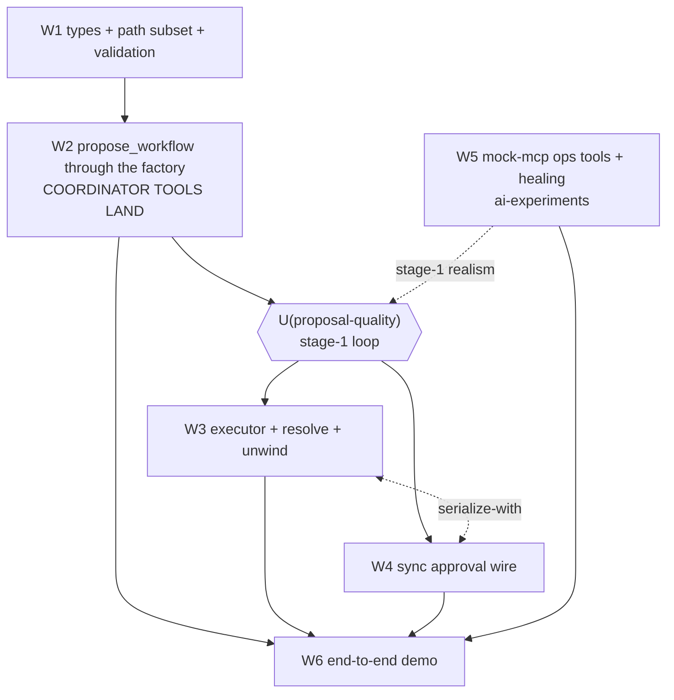

# Plan: Workflow-proposal MVP — pre-authorized remediation DAGs with rollback + argument binding in agent-driver-prototype

## Plan sizing

| Scope | Added | Removed | Net |
|---|---|---|---|
| Prototype `src/workflow/` + 3 additive seams (W1–W4) | ~1,080 src, ~950 test | ~20 | additive |
| ai-experiments mock-mcp ops surface (W5) | ~220 src, ~80 test | ~10 | additive |
| New boardkit board + cards + tooling docs | ~450 docs | 0 | additive |

Net: the project grows a new module plus three additive seams; existing lanes
(coordinator four tools, DAG executor, shim) are untouched except for the
optional-tool registration, one config section, and one conditional template
section. Complexity for existing work: neutral.

---

## Scope

- **Core problem:** remediation in the test rigs (world-based RCA scenarios,
  Tony's SREGym mitigation phase, k8s-sre) is today the agent free-handing
  mutating MCP tool calls one at a time, with no approval boundary, no declared
  rollback, and no deterministic apply. The AURA Workflows design (governance
  workstream, v6 + direction-first republish) specifies the answer: an agent
  proposes a workflow (N tool-call steps + per-step rollback + argument
  binding), a human approves once, and a deterministic executor applies with
  the model out of the loop. That design is unimplemented anywhere. This MVP
  proves it in the spike repo.
- **Audience:** Mike (design owner), a collaborator onboarding into
  agent-driver-prototype (the board must be self-describing in this repo), and
  the AURA Workflows direction (this MVP is its proving ground and ADR
  evidence).
- **Success:** an end-to-end run against the world-based rig where workers
  investigate read-only, the coordinator proposes a remediation workflow with
  `$from`-bound rollback, a human approves through the sync webhook shape, the
  executor applies deterministically, the world's logs heal, and a deliberate
  mid-plan failure unwinds via the declared rollbacks.
- **Non-goals (V1):** no park/reify; no durable approval rows, `plan_digest`,
  `refresh`/`expect`, or `config_fingerprint` (AURA Phases 3–4); no
  `[workflow.<name>]` TOML definitions (Phase 4); no concurrent apply;
  no fan-out/wildcard bindings; no arithmetic on bindings; no new SSE approval
  event (existing `tool_start`/`tool_complete` already surface the proposal on
  the stream); no remediation surface beyond the three ops tools; no limits,
  quotas, or cooldowns beyond the configured hold budget the sync contract
  requires.

---

## Decisions ruled this session (ADR raw material)

| # | Decision | Ruling | Note |
|---|---|---|---|
| D1 | Demo rig | mock-mcp-service (world-based) + new stateful ops tools; logs heal after a correct fix | SREGym (trogers branch) confirmed diagnosis+mitigation is the live pattern; k8s-sre rig kept as an alternate target, not the demo |
| D2 | Staging | Stage 1: proposal quality (propose-only mode, iterate until satisfied). Stage 2: approval→apply accuracy. V1 needs only the **sync governance shape**; plugs into governance or aura-sandbox approvals for blocking sync HITL | No park until needed |
| D3 | Workflow shape | steps with string ids, optional `dependencies` DAG deps (string step ids), per-step `exports` + `rollback`; rollbacks carry `$from` references to earlier exports; read steps may declare `rollback: null` (rendered honestly to the approver) | Field name ruled by Mike 2026-09-29: `dependencies`, matching the prototype's `Task.dependencies` and the 271 `Task` type. The wiki direction doc names this field `after` (Decision 2's rename); the ADR must record this reconciliation |
| D4 | Binding syntax | `$.a.b[0]` JSONPath-subset paths in `exports`; `{"$from": "step.export"}` inline anywhere in the arg tree; optional `min`/`max` bounds on a reference, checked executor-side at resolve time | Bounds semantics reconstructed — verify against the private artifact (`18886ec0…`) before the ADR; the artifact could not be fetched (JS-rendered, private) and the scratchpad twins are gone |
| D5 | Mount + config | new `src/workflow/`; `ProposeWorkflowTool` implements the substrate `Tool`; the **factory seam** — `coordinator_tool_definitions` parameterized with the extra definition, preamble/template tool claims derived from the factory, tool-truth tests extended to a mounted scenario (K3 finding 1); `[workflow]` TOML section in `ShimConfig`; tool's `SidecarClient` wired at `sse_shim/server.rs:343` | Merge dependency on the card/s114 re-golden (extraction already committed, b3dbc7c). Coordinate with tb/S103 |
| D6 | Division of labor | workers investigate read-only; the coordinator (smart model) owns remediation and proposes the workflow; the coordinator never free-hands mutating calls (it has no MCP tools today — the workflow executor is its only direct MCP path) | — |
| D7 | Ops surface | `ops_get_cluster_state`, `ops_scale_app`, `ops_rollback_deploy`; per-session remediation state so incident clusters stop after a correct fix; optional `remediation:` ground-truth block in scenario YAML | ~150–250 lines in ai-experiments |
| D8 | Board | new boardkit board **inside agent-driver-prototype** (self-describing; collaborator can dive in without aura-session-docs context) | Corrected mid-session from aura-orchestration-mode board, whose charter excludes this scope |
| D9 | Failure default | unwind: on step failure run declared rollbacks of completed steps in reverse completion order; a rollback that itself fails stops the unwind and reports both failures loudly | This is AURA Decision-3 evidence: unwind + loud stop |
| D10 | Goal-2 deliverable | the demo workflow spec (below), executed by the demo card | — |
| D11 | Cancellation mid-apply (K3 review, ruled) | stop dispatching immediately; record residual applied steps loudly; do **not** unwind | An interrupt means stop; running more mutations (even pre-authorized rollbacks) after an operator cancelled contradicts the interrupt. Prototype ruling; the ADR records the alternative (auto-unwind is within the approved authorization) as the open upstream question |

---

## The V1 workflow shape

```jsonc
{
  "goal": "Mitigate the payments db-primary connection pool exhaustion",
  "steps": [
    {
      "id": "state",                       // string, unique
      "dependencies": [],                   // optional DAG deps; [] = root
      "tool": "ops_get_cluster_state",
      "args": { "app": "payments" },        // literal JSON
      "exports": {                          // named $.-paths over this step's result
        "current_replicas": "$.deployment.replicas"
      },
      "rollback": null                      // read-only step: nothing to undo
    },
    {
      "id": "scale",
      "dependencies": ["state"],
      "tool": "ops_scale_app",
      "args": { "app": "payments", "replicas": 6 },
      "exports": {},
      "rollback": {                         // compensating call; args may bind
        "tool": "ops_scale_app",
        "args": { "app": "payments",
                  "replicas": { "$from": "state.current_replicas", "min": 1, "max": 20 } }
      }
    }
  ]
}
```

Rules:
- Validation at propose time: unique ids; `dependencies` acyclic and
  references earlier-declared steps; every `$from` names a declared export of
  a step in the dependencies-closure (a step's own `rollback` may
  additionally reference the owning step's own exports — it completed if its
  rollback runs); tool names exist in the startup discovery inventory; and
  step `args` validate against the discovered tool's `inputSchema`
  (the inventory already carries it — `SidecarTool::input_schema`), so the
  approver never authorizes a schema-invalid instance (K3 finding 2).
- Apply: topological order by `dependencies`, one step at a time (no
  concurrent apply in V1). Each step's `SidecarContent` **text is parsed as
  JSON** (the `resolve` module's input contract; a non-JSON body is a step
  failure via missing path); exports resolved per the declared paths; a
  missing path is a step failure.
- Bounds (`min`/`max`) are checked at resolve time, executor-side — the model
  never supplies or verifies bound values (AURA argument-model rule). A
  bounds violation on step N's resolve is a step-N failure and unwinds steps
  1..N−1 like any other failure.
- Run record (in-memory, returned as the tool observation): per-step status
  over the full vocabulary — `pending`/`not_started`, `applied`, `failed`,
  `unwound`, `rollback_failed`, `not_unwound` — with captured results and
  rollback attempts. Any partial-unwind observation **enumerates the
  residual applied steps** (the ones whose rollbacks never ran) so the
  coordinator can replan against the true post-failure state (K3 finding 3).
- Cancellation mid-apply (D11): stop dispatching, record residual state, do
  not unwind. Cancellation during the approval hold: stop, no apply.
- Approval binds the proposed instance: structure + literal args + declared
  rollbacks; `$from` references resolve at apply time. The notify digest is
  `sha256` over `serde_json::to_vec(&workflow)` (serde struct field order is
  stable; the approver echoes what it receives, so no external canonical
  JSON scheme is needed).
- Deny and hold-timeout return as ordinary tool observations the coordinator
  can replan against.

## Sync approval wire (V1)

Reuse the governance receiver contract shape, client-side only:
- `POST` the notify payload to the configured approval URL:
  `{ workflow: <full JSON>, digest: <sha256 over serde_json::to_vec(&workflow)>, rendered: <human digest>, session_id }`.
- Poll `GET` the status URL until decided: `200 {approved, reason}` decides;
  pending (207/202) keeps the blocking hold; the hold budget is a required
  `[workflow]` config value (no invented default; the sync contract's 900s is
  the documented precedent).
- The hold poll selects on the request cancellation token; cancellation
  returns an observation, never hangs.
- Pluggable: point at governance, the aura-sandbox approvals, or a loopback
  receiver. Integration tests spin an in-process axum approval server; the
  live demo may reuse the aura-sandbox HITL rig.

## Insertion points (verified against the tree)

| Seam | File | Change |
|---|---|---|
| Tool registration (K3 finding 1 — the load-bearing seam) | `src/coordinator_loop/tools/mod.rs:39` (`coordinator_tool_definitions`), `src/config_builders.rs:85–93` (`build_coordinator_preamble`'s hardcoded tools section), `src/prompts/planning_loop_prompt.md` (hardcoded "You have four tools" + numbered list), `src/tool_truth_tests.rs:607–652` | **parameterize the factory** with the extra definition(s); derive the preamble's tools section and the numbered list from the factory (count and list conditional); extend the tool-truth tests to a mounted scenario. Appending `extra_tools` in `CoordinatorLoop::new` alone would keep every test green while the runtime claims four and registers five — the exact silent divergence S114 exists to prevent. Unmounted goldens stay byte-identical (conditional-empty rendering) |
| Client wiring | `src/sse_shim/server.rs:343` | `ProposeWorkflowTool` gets its `SidecarClient` where `self.sidecar.clone()` is already in scope (the same site that feeds `WorkerToolMount`); `CoordinatorLoopConfig` gains no MCP field |
| Apply path | `src/mcp_client/client.rs:410` (`SidecarClient::call_tool`) | used as-is; no changes |
| Config | `src/shim_config.rs` | additive `[workflow]` section (enabled, approval_url, hold_secs; hold_secs required-when-enabled, validated like transport/url); lives in `ShimConfig` alone — no `OrchestrationConfig` edit needed |
| Module | `src/workflow/{plan,resolve,executor,tool,render}.rs` + `DESIGN.md` | new; mirrors AURA's `workflow/{plan,digest,record,resolve,executor,tool,render}` with `digest` folded into `render` and `record` in-memory |
| Ops tools | `ai-experiments/mock-mcp-service/src/handler.rs` + `views.rs` + scenario model | 3 ops tools + per-session healing + `remediation:` ground truth |

S114 status (verified 2026-09-29): **closed and merged** (PR #14, `4ee22bc`;
tree clean). `coordinator_tool_definitions(sections)` is live at
`src/coordinator_loop/tools/mod.rs:39` and is the seam W2 parameterizes —
W2's cross-board dependency is cleared. The offline MCP test rig is
`SidecarClient::connect_stream` + scripted rmcp server behind the
`test-support` feature.

---

## Implementation stages (cards on the new board)

Board: new boardkit board in `agent-driver-prototype` (root `boardkit.toml`,
`docs/board/cards`, id prefix `W`, charter: owns the workflow-proposal
mechanism in this repo; not: aura product implementation, agent-driver-rs
crate internals, tb S-card lanes). Mint via
`/usr/local/bin/python3` with `PYTHONPATH=~/dev/boardkit/src` (uv python hangs
on this Mac — recorded hazard). Cards carry the AURA context inline so the
board is self-describing.

#### Stage W1: workflow type skeleton + `$.`-path subset 🛑 USER GATE
- Goal: `workflow/plan.rs` types (`WorkflowSpec`, `WorkflowStep`,
  `RollbackSpec`, `ExportSpec`, `ArgValue` literal/reference/bounds) with
  validation and the `$.a.b[0]` → serde_json-pointer conversion; `DESIGN.md`
  type inventory in the repo's established style. Step `dependencies` are
  string step-ids (the `Task.dependencies` vocabulary, string-keyed).
  Validation includes tool-name checks AND step-args checks against the
  discovered tools' `inputSchema`s (K3 finding 2).
- Changes: `src/workflow/` new; no coordinator/shim edits.
- Gates: S → A → U (new public types = interface change)
- [ ] Gate S: gate-probes; `cargo fmt --check`, `cargo clippy --all-targets --locked`, `cargo test --locked`; unit tests for validation (incl. schema rejection) + path conversion
- [ ] Gate A: rust-reviewer (gpt-5.6-sol-fast) on the diff
- [ ] Gate U: present the type surface (the shape is ADR-relevant)
- Done when: types validate the shape rules incl. inputSchema checks; suite green.

#### Stage W2: `propose_workflow` tool, factory seam, config, template section 🛑 USER GATE
- Goal: propose-only mode. `workflow/tool.rs` + `workflow/render.rs` (human
  digest); the **factory-parameterization seam** per the insertion table —
  `coordinator_tool_definitions` takes the extra definition, the preamble's
  tools section and the planning template's numbered list derive from the
  factory, and the tool-truth tests gain a mounted scenario (K3 finding 1);
  `[workflow]` section in `ShimConfig`; the tool's `SidecarClient` wired at
  `sse_shim/server.rs:343`. Unmounted rendering byte-identical (goldens
  unchanged); mounted rendering named by new goldens.
- Changes: `src/workflow/{tool,render}.rs`, `src/coordinator_loop/tools/mod.rs`, `src/config_builders.rs`, `src/prompts/planning_loop_prompt.md`, `src/tool_truth_tests.rs`, `src/sse_shim/server.rs`, `src/shim_config.rs`.
- Gates: S → A → U (interface + prompt change)
- [ ] Gate S: gate-probes; fmt/clippy/test; unmounted goldens byte-identical; tool-truth tests pass mounted AND unmounted
- [ ] Gate A: rust-reviewer on the diff
- [ ] Gate U: present the mounted-tool diff + template change
- Done when: a coordinator run can call `propose_workflow` and receive the rendered digest; nothing applies; the tool-truth invariant holds in both modes.
- **Stage-1 loop (user-ruled): run the world scenarios against this surface and iterate on proposal quality until satisfied.** Evidence filed on the card.

#### Stage W3: deterministic executor + resolve + unwind
- Goal: `workflow/executor.rs` + `workflow/resolve.rs` — topological apply via
  `SidecarClient::call_tool` (result text parsed as JSON), export capture,
  `$from` + bounds resolution, in-memory run record with the full per-step
  status vocabulary, unwind-with-loud-stop (D9) with residual-applied
  reporting, cancellation-halt (D11). Offline integration tests on the
  `test-support` scripted-server rig (`connect_stream`), six scenarios:
  success; step failure → reverse-order unwind; rollback failure → loud
  stop, both failures + residual set reported; bounds rejection → unwind of
  prior steps; binding-miss; cancellation mid-apply → halt + residual state
  recorded (deny is a W4 wire leg, not an executor scenario — K3 finding).
- Changes: `src/workflow/{executor,resolve}.rs` + `tests/workflow.rs`.
- Gates: S → A
- [ ] Gate S: gate-probes; fmt/clippy/test; the six integration scenarios above
- [ ] Gate A: rust-reviewer on the diff
- Done when: all six scenarios pass offline against a scripted MCP server.

#### Stage W4: sync approval wire 🛑 USER GATE
- Goal: notify POST + GET poll, blocking hold in the tool body, hold budget
  from `[workflow]`, deny/timeout/cancel-hold as observations; in-process
  axum approval server in tests; pluggable approval URL. The wire client is
  independent of W3 and may start in its lane; the end-to-end
  approval-gates-apply leg follows W3.
- Changes: `src/workflow/approval.rs` (+ tool wiring), `tests/workflow.rs`.
- Gates: S → A → U (wire contract)
- [ ] Gate S: gate-probes; fmt/clippy/test; approve/deny/timeout/cancel-hold legs against the in-process server
- [ ] Gate A: rust-reviewer on the diff
- [ ] Gate U: present the wire contract (payload, digest, status handling)
- Done when: approval gates apply end-to-end offline.

#### Stage W5: mock-mcp ops surface (ai-experiments)
- Goal: `ops_get_cluster_state`, `ops_scale_app`, `ops_rollback_deploy`;
  per-session remediation state; incident clusters stop after a correct fix;
  `remediation:` ground-truth block (db-pool-exhaustion first).
- Changes: `mock-mcp-service/src/{handler,views}.rs` + scenario model + `db-pool-exhaustion.yaml`.
- Gates: S → A
- [ ] Gate S: gate-probes; cargo test in mock-mcp-service; a scenario test proving logs heal after `ops_scale_app`
- [ ] Gate A: rust-reviewer on the diff
- Done when: a remediation call measurably heals the session's incident timeline.

#### Stage W6: end-to-end demo 🛑 USER TEST
- Goal: live run — workers investigate db-pool-exhaustion read-only;
  coordinator proposes the demo workflow spec (below); human approves via the
  sync webhook (aura-sandbox rig or loopback receiver); executor applies;
  logs heal; a second run with a forced mid-plan failure shows the unwind.
- Changes: none expected in src (demo config + evidence).
- Gates: S → A → M → T
- [ ] Gate S: gate-probes over the demo config/evidence
- [ ] Gate A: rust-reviewer (or frontier if config-only) sign-off on evidence packaging
- [ ] Gate M: agent runs the demo, files evidence (SSE capture, approval payload, run record, before/after histograms)
- [ ] Gate T: handout — run commands, expected observations in order (proposal on stream → approval payload → apply → healed histogram; failure run → unwind record), failure signatures, revert steps
- Done when: the user has watched both runs.

Pull order (coordinator-tools-first, ruled 2026-09-29): opening wave
**W1 ∥ W5** → **W2** (the coordinator-tools card; lands `propose_workflow`
through the factory and carries the stage-1 proposal-quality user gate) →
**W3 ⇄ W4** (both depend on W2; serialized against each other — shared
`tests/workflow.rs` and tool wiring; either order) → **W6** (needs W2, W3,
W4, W5). W2 needs only W1: if W5 lags, the stage-1 loop runs a first pass
against read-only workflows over the existing mock tools and re-runs against
the ops tools once W5 lands. W2's S114 merge dependency is cleared (PR #14).

### Boardkit DAG (card frontmatter)

| Card | depends | serialize-with | status at mint | gates | user-gates |
|---|---|---|---|---|---|
| W1 types + `$.`-path + validation | `[]` | `[]` | ready | S → A → U | type-surface |
| W5 mock-mcp ops surface (ai-experiments) | `[]` | `[]` | ready | S → A | — |
| W2 `propose_workflow` through the factory (coordinator tools land) | `[W1]` | `[]` | blocked | S → A → U → U | code-review, proposal-quality |
| W3 executor + resolve + unwind | `[W2]` | `[W4]` | blocked | S → A | — |
| W4 sync approval wire | `[W2]` | `[W3]` | blocked | S → A → U | wire-contract |
| W6 end-to-end demo | `[W2, W3, W4, W5]` | `[]` | blocked | S → A → M → T | demo |

Board: `wip = 2` (the opening wave is exactly two cards; raise to 3 only if
the W3/W4/W5 lanes need it). `id_prefix = "W"`.



Note on S103 (tb board, coordinator-mcp-filter): if it lands, the coordinator
gains opt-in MCP tools for investigation while remediation still routes
exclusively through `propose_workflow` (D6) — the factory seam composes with
it; whichever lands second re-words the derived claims once, per S114's
invariant.

---

## Demo workflow spec (goal-2 deliverable)

The reference remediation workflow for `db-pool-exhaustion` — the yardstick
for stage-1 proposal quality and W6's acceptance. Exact arg shapes for the
read steps are pinned at W6 pull against the real tool schemas (marked ⚑).

```jsonc
{
  "goal": "Mitigate the payments db-primary connection pool exhaustion: scale the payments deployment to restore connection capacity",
  "steps": [
    {
      "id": "state",
      "dependencies": [],
      "tool": "ops_get_cluster_state",
      "args": { "app": "payments" },
      "exports": {
        "current_replicas": "$.deployment.replicas",
        "image": "$.deployment.image"
      },
      "rollback": null
    },
    {
      "id": "scale",
      "dependencies": ["state"],
      "tool": "ops_scale_app",
      "args": { "app": "payments", "replicas": 6 },
      "exports": {},
      "rollback": {
        "tool": "ops_scale_app",
        "args": { "app": "payments",
                  "replicas": { "$from": "state.current_replicas", "min": 1, "max": 20 } }
      }
    },
    {
      "id": "verify",
      "dependencies": ["scale"],
      "tool": "get_log_histogram",          // ⚑ existing read tool; args pinned at W6
      "args": { "window": "post-remediation, app:payments level:error" },
      "exports": {},
      "rollback": null
    }
  ]
}
```

What it shows off: read→export→bind (rollback bound to captured prior state),
bounds on a reference, DAG deps, honest `rollback: null` on reads, healing
verification through an existing observability tool on the same server.

## Review (goal 1) — DONE: Kimi K3, PASS-WITH-FIXES

Routing record: frontier-reviewer (gpt-6-astra) was unavailable (model
error); rust-reviewer re-dispatch came back empty; Mike ruled "call kimi cli
with K3" — run via `~/.kimi-code/bin/kimi -m kimi-code/k3 -p` read-only in
the repo. Packet: `workflow-mvp-review-packet.md`; verbatim review:
`workflow-mvp-k3-review.md` (both in this directory). Session resumable as
`kimi -r session_10b0dcf7-2c7a-44b9-a023-6c6aee62b624`.

Verdict: **PASS-WITH-FIXES.** Disposition of the three critical findings —
all ACCEPTED and folded into this plan:

1. **Blocking (insertion seam):** the driver-append seam would silently break
   S114's single-source invariant (factory + preamble + template all hardcode
   four; tool-truth tests only pin the unmounted factory). → W2's seam is now
   factory parameterization with derived claims and a mounted test scenario
   (insertion table reworked).
2. **Major (missing risks):** propose-time `inputSchema` validation of step
   args (→ W1 validation rules) and cancellation-mid-apply semantics (→ D11
   ruling + W3 scenario six).
3. **Major (partial-unwind reporting):** the run record and observation now
   enumerate residual applied steps over the full status vocabulary
   (`not_started`/`applied`/`failed`/`unwound`/`rollback_failed`/`not_unwound`).

Minor findings ACCEPTED as spec-precision: resolve parses result text as
JSON (stated as the resolve module's input contract); rollback self-reference
closure rule stated; digest canonicalization named (`sha256` over
`serde_json::to_vec`, approver echoes); deny leg moved from W3 to W4; W4
joins the parallel lane. Minor findings RECORDED, not folded: W4/W3 ordering
note (superseded by the parallel lane); S114 accuracy corrections (folded
into the insertion table).

Reviewer corrections adopted: S114 extraction is committed on `card/s114`
(b3dbc7c), the uncommitted diff is prompt tightening + re-golden; the offline
MCP rig is `SidecarClient::connect_stream` + scripted rmcp server
(`test-support`), not "duplex_pair".

## ADR data inventory (leftovers for a future ADR)

- The decision table D1–D11 above, with the grill record as provenance; the
  K3 review (PASS-WITH-FIXES, three critical findings folded) as vetting
  provenance — verbatim record in `workflow-mvp-k3-review.md`.
- Naming reconciliation (record verbatim): the wiki direction doc names the
  step-ordering field `after` (Decision 2's rename from the reviewed
  `dependencies`/`bindings` pair, with a standing do-not-fix-it-back hazard
  note for the direction doc); Mike ruled 2026-09-29 that the prototype's
  workflow shape uses `dependencies`, matching the prototype's
  `Task.dependencies` and the 271 `Task` type. The ADR states which surface
  each name belongs to.
- Divergences from AURA v6, deliberate: no park (blocking hold instead), no
  durable row/digest/fingerprint, no refresh/expect, no TOML definitions,
  in-memory record, topological-but-sequential apply, no new SSE event.
- Evidence this MVP contributes to aura's open rulings: Decision 1
  (instance-only approval in the prototype), Decision 2 (`exports`+`$from`
  validated in practice), Decision 3 (unwind + loud stop), plus the new
  cancellation-mid-apply question (D11: prototype rules halt-no-unwind; the
  alternative — auto-unwind is within the approved authorization — is the
  open upstream question).
- Open verification: bounds semantics vs the private artifact (`18886ec0…`);
  the binding table and path-traversal examples could not be retrieved
  (artifact JS-rendered/private; scratchpad twins wiped). The ADR must verify
  the reconstructed `min`/`max` bounds against the artifact before citing v6.
- Prior art already surveyed: Terraform saved plans (strongest precedent),
  Rundeck (negative), saga/compensation, capability tokens — cite the
  governance workstream's 13-system survey, do not redo it.

## Verification

- Smoke test: `cargo build && cargo test` in the prototype (all offline,
  `test-support` scripted-server rig for MCP legs); `cargo test` in mock-mcp-service
  for W5; the W6 live run is the end-to-end smoke.
- Deterministic checks: fmt/clippy/test at MSRV per CI; W3's six integration
  scenarios; W4's approve/deny/timeout/cancel legs.
- Rollback: every stage is a separate card/branch — revert by branch; W1–W4
  additive (delete `src/workflow/` + revert the three seams); W5 reverts the
  ops tools and scenario block; the board is docs-only.
