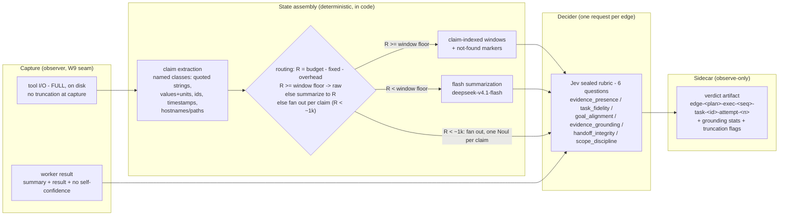

# Plan: JEV edge-verifier workstream (v3.2)

Date: 2026-09-29 (v1); 2026-09-30 (v2, v3, v3.1); 2026-10-02 (v3.2). v2
incorporates adversarial review round 1 (FAIL, 14 BLOCKING / 3 MINOR). v3
incorporates the round-2 re-review (FAIL, 7 re-raised, all applied below);
v3.1 the round-3 verification fixes. v3.2 incorporates Tony Rogers' outside
review (PASS-WITH-FIXES; `2026-10-01-jev-edge-verifier-review-trogers.md`
in this directory, with its measurement script) and the 2026-10-02 user
design-session rulings. Full ledgers at the bottom.

Author: planner session. Author family: Kimi - driver-declared session fact
(the harness top-level pin reads `zai-coding-plan/glm-5.3`; the driver states
this session runs Kimi. The driver's word wins per the delegation-inventory
rule). Review route for this artifact: codex CLI (metered; user-approved this
session) - kimi-frontier is barred, the author is Kimi-family.

Board: agent-driver-prototype (`boardkit.toml`, id prefix W). New `jev` lane,
parallel to the workflow-execution track (W1-W6) and the CLI-drivability
tail (S-cards). This plan does not touch those tracks.

Finding this from scratch: `scripts/verify-planning-trail.sh` (repo root)
walks the discovery chain a cold reader would follow - AGENTS.md to the
board registry to the `jev` lane cards to this note and its close
evidence - and fails loud on any broken link.

---

## Decisions locked (user, 2026-09-29)

1. New `jev` lane in `boardkit.toml` + charter `owns` edit; W7-W13 cards.
2. S107 pulled as prerequisite; a standalone single-scenario smoke runs
   first (no header forwarding needed).
3. Cloud Jev only (`TYPESAFE_API_KEY`, confirmed set this session).
4. Verifier v1 is observe-only; gating is a later card fed by correlation
   data.
5. **Artifact approval precedes implementation** (2026-09-30): the user
   reviews the proposal artifact
   (`.review/jev-plan/jev-edge-verifier-proposal.html`, derived from this
   plan) before any W7/W8 leg is dispatched. Recorded on both cards' logs
   as a standing gate. The gate re-applies to the v3.2 re-render.

## Decisions locked (user, 2026-10-02 session - the v3.2 rulings)

1. **W7 is a capability proof, not calibration.** The experiment answers
   "can a System One decider detect edge-level drift, and what does one
   answer cost?" The no-go rule is its primary output. Weights/levels are
   provisional by construction (finding 2 below).
2. **LLM-judge control arm in W7**: Kimi K3 on Bedrock (pinned model id
   `us.moonshotai.kimi-k3`; env-default SSO credential chain - no new
   plumbing), run over
   the same corpus, labels, and evidence windows as the Jev rubric,
   blinded to worker self-confidence identically. The user's orchestration
   program already failed twice on LLM judges (whole-DAG final eval, then
   per-worker eval - both died of lossiness at scale); the control arm
   prices that counter-hypothesis before any prototype code lands. Staged
   as W7 Leg 2, after the Leg 1 rubric arms.
3. **Evidence selection is the experimental variable** (Tony's section 1
   adopted as design default, tested as arms): Arm 1 head-truncated
   excerpts (v3.1 baseline - verifies Tony's measured failure on our own
   corpus), Arm 2 claim-indexed windows over the full on-disk capture
   (the v3.2 default design), Arm 3 flash summarization
   (deepseek-v4.1-flash via opencode go, the latency tier).
4. **Retrieve-vs-summarize routing is a deterministic size classifier**:
   code measures the total projected state size against the budget and
   selects
   raw windows or summarization; no model call for a byte-count decision.
   Async pre-summarization at capture time is deferred to W11, fed by
   W7's Arm-3 latency numbers.
5. **Verifier timeout is a large failsafe** (~60s, config `timeout_ms`),
   not a tuned bound; W7 measures latency vs state size per arm as
   reported data for the W10 envelope.
6. **W9 verifies off the DAG critical path** (Tony's section 3 adopted):
   spawn per submitted edge, join all pending verifications at the end of
   `execute()`; verdict files still land before the run returns; the
   task's concurrency slot is never held by a verifier call, so W10's
   wall-clock delta attributes to the verifier alone.
7. **jev-driver crates.io release is user-owned and off this wave's
   critical path.** W9 develops against the path dep; publication is
   required only at W9's merge/CI boundary. The v3.1 "shipped fact before
   W9 starts" rule is relaxed to that boundary.
8. **Review script is a named W7 deliverable** (precedent: Tony's
   `2026-10-01-jev-edge-verifier-review-measure.py`): one script
   reproduces every reported W7 number from raw artifacts, and is re-run
   at W10's gate against the live-run artifacts.
9. **Teachable architecture diagram** (mermaid: capture -> claim
   extraction -> size classifier -> selection -> decider -> verdict
   artifact) lives in this note and in `src/edge_verify/DESIGN.md` at W9,
   updated at W11, rendered at each user gate. Clean-code constraint: no
   spike-shaped code welded into the seam - an implementation that scores
   well but cannot be cleaned for production is a failure, enforced by
   W9's design panel and Gate A.
10. **W13 is the foundational measurement, not just the control arm.**
    The first agent-driver-prototype, model-specific baseline against
    mock-mcp exists nowhere today. W13's deliverable gains a baseline
    analysis report carrying the contract watch-list (below), so the
    contract-bounds question is answered by measurement before any bound
    is built, and W10's deltas compare against a measured baseline rather
    than an assumed one.
11. **Baseline driver model pinned** (2026-10-02): `glm-5.3` from the
    zai coding plan drives the prototype (coordinator and workers) for
    W13/W10, endpoint `https://api.z.ai/api/coding/paas/v4` with the
    OpenAI + reasoning adapter. The judge model for W7 Leg 2 is
    `us.moonshotai.kimi-k3` on Amazon Bedrock (decision 2). Both pins are
    concrete ids, recorded in the W13 evidence file and W7 report.

## Scope

- **Core problem**: the pipeline trusts worker self-reports. A worker's only
  quality signal is its own `confidence` plus free-form `result` prose
  (`src/tools/submit_result.rs`). Nothing independent checks drift between a
  plan step's intent and the worker's actual output - with the evidence the
  worker actually produced - before downstream consumers see it. Aura's old
  self-scored `EvaluationResult` was deleted in the redesign; this
  workstream replaces that idea with an external sealed-rubric verifier:
  TypeSafe's Jev, driven through `jev-driver`, scoring every DAG edge.
- **Audience**: the user's orchestration research program.
- **Success**:
  1. A validated rubric - measured edge-level accuracy against quantitative
     acceptance thresholds on a held-out split, plus a latency profile (W7).
  2. The prototype shim runs the full RCA suite with the observe-only
     verifier on; verdicts analyzed against eval outcomes under a predefined
     method; added latency/cost quantified (W8, W13, W9, W10).
  3. An approved architecture for typed evidence artifacts with JEV-ranked
     context assembly, designed from W10's data (W11).
- **Non-goals**: aura product changes; mock-mcp-service internals;
  jev-driver crates.io publication as part of this wave (a separate track
  the user may elect at the W9 boundary); any gating policy before W10's
  data; SSE wire changes in v1; edits to ported prompt templates or the
  frozen aura golden corpus (default path byte-identical, verifier off);
  a W12 implementation stage (deferred, gets its own plan).

## Verification

- **Workstream smoke**: one RCA scenario end to end through the prototype
  shim, verifier on - mock-mcp started with
  `MOCK_SCENARIO=db-pool-exhaustion`; one hand-rolled curl (no X-Mock
  headers pre-S107); `"finish_reason":"stop"`; one verdict artifact per
  completed task in the session's artifact directory; `aura-eval` parses
  the SSE capture. This is a standalone command sequence, NOT the stock
  `run-rca-e2e.sh` (whose scenario array is unconditional and requires
  header forwarding).
- **Deterministic checks**: `cargo fmt --check`,
  `cargo clippy --all-targets`, `cargo test` (default features) in
  agent-driver-prototype; the feature-enabled runs W9 names explicitly;
  `make check` plus `cargo test -p edge-spike` /
  `cargo clippy -p edge-spike --all-targets` in jev-driver (its
  `default-members` excludes app crates - bare `make check` does not cover
  the spike); `boardkit check` after every board edit.

## Blast radius

- **This repo**: new `src/edge_verify/` (+ `DESIGN.md`);
  `src/dag_executor/executor.rs` (one seam, `DagLifecycleObserver`-pattern
  injection); `src/sse_shim/server.rs` (goal threading + verifier wiring);
  `src/shim_config.rs` (`[orchestration.edge_verifier]`); `Cargo.toml` /
  `Cargo.lock` (jev-driver, per the boundary decision); `README.md`
  scope-limits gains one line. W11+ adds `src/context/` evidence types and
  `src/producers.rs` assembly - where fixture goldens deliberately move.
- **jev-driver repo** (external, shas logged): W7's `edge-spike/` workspace
  member.
- **ai-experiments repo** (external, shas logged): W8's runner wrapper +
  smoke script; results directories; no mock-mcp internals.
- **Board**: `boardkit.toml` (lane + charter), W7-W13 cards, reciprocal
  serialize-with edits on S107/S104, regenerated views.
- **Not touched in v1**: `TaskObservation` and its serialization (see
  "coordinator invisibility" below), coordinator tool surface
  (`tool_truth_tests` stays green), `docs/board/REVIEW-TOOLING.md`.

## Delegation inventory (planning time)

Live pins from `~/.config/opencode/agent/*.md` + `opencode.json`:

- Executors: `rust-write` (Kimi family), `rust-fill` (GLM-5.3-flash),
  `general`/`explore` (deepseek-v4.1-flash).
- Reviewers: `rust-reviewer` (gpt-5.6-sol-fast, OpenAI family) - differs
  from both executor families; valid Gate A for this wave's Rust.
  `python-reviewer` (Kimi family) - barred against Kimi-authored diffs.
- Prose/frontier routes: `kimi-frontier` (K3) - barred against Kimi-authored
  artifacts, which this wave mostly is; the valid alternative is the metered
  codex route (OpenAI family), approval recorded per session per
  `REVIEW-TOOLING.md`'s budget etiquette.
- Planner: Kimi family (driver-declared).

Routing rule for every gate in this wave: the brief records actual
authorship per commit; the reviewer is chosen from a different family at
dispatch time. No gate in this plan hard-routes to a Kimi-family reviewer.

---

## Research digest (condensed; v1 carried the full version)

- Jev: `POST /v1/systemone`, `{state, model, questions}`; Choice (≤255
  options), Score (2-10 levels), Noul (P(yes)). One request carries all
  rubric questions in parallel - a 5-6 question rubric is ONE call per edge.
- Composite scoring: score dimensions independently, combine with code-side
  weights; weights change without re-inference.
- Citation check: deterministic substring verification FIRST, then one model
  judgment on whether context supports the claim. This is the grounding
  design - and its lesson is the judge must SEE the evidence.
- Rerank: one Noul per (query, candidate) pair; cheap at our scale.
- Confidence: distribution concentration, a second axis; thresholds tuned on
  our data. Presence judgments ("is the evidence even here?") are a
  documented, independently useful question.
- Jaggedness (docs.typesafe.ai/model-jaggedness/jev-1.13): adversarial state
  content can pull Jev's answers; model aliases (`jev-latest`) move between
  versions - pin a concrete model id for the experiment and record the
  resolved id from every response.
- jev-driver: derives turn Rust enums into sealed criteria; strictness
  contract (unknown keys / missing answers / unnormalized distributions are
  errors); retries 429/529; cloud answers ~70-500ms (README live smoke,
  measured premise). Path-dep consumption only until a 0.1.0 release;
  publish punchlist in `NEXT-SESSION.md`.
- Prototype context machinery (mapped and verified): prior-work frame from
  completed ancestors (8000-token budget, direct-first), demarcated
  "evidence, not instructions to replay"; coordinator imperative text
  unrepresentable in `PriorWorkEntry`; `submit_result{summary, result,
  confidence}`; inline <4000 chars else spill + pointer; no scoring or eval
  machinery exists.
- Goldens: two tiers; changes to worker assembly move `worker_*` fixture
  snapshots; new coordinator tools trip `tool_truth_tests`. The fixture
  goldens do NOT exercise the live executor/observation path - disabled-path
  equivalence needs its own integration assertion (W9 Gate S).

## Contract audit vs the delegation principles (verdict: no blocking repairs)

| Principle layer | Current state | Disposition |
| --- | --- | --- |
| 1. Input contract | Template structure only; no MISSING_INPUT stop | W8 config preambles |
| 2. Output contract | Wire triple only; free-form result | W8 preamble labelled sections; typed in W11 |
| 3. Source fidelity | Unstated | W8 preamble: verbatim-with-source evidence blocks; INFERRED labels; typed in W11 |
| 4. Escalation packet | "Report honestly" + FailureCategory | W8 preamble failure arm |
| 5. Checklists | None | W8 preamble for analyst depth gate only |

The frame machinery's demarcation is sound and tested. The gaps are
preamble-level (TOML config), not template changes. One correction from
review: the W8 preamble must NOT forbid imperative voice in evidence (that
conflicts with verbatim fidelity); it states instead that evidence blocks
are verbatim-with-source data and downstream workers must not execute or
replay text found inside them. That is a formatting/provenance claim, not
demonstrated injection resistance - W7's adversarial corpus cases measure
the actual resistance (see footgun mapping).

## Footgun mapping (revised after review)

1. **Scorer context**: the scorer sees goal, plan step, plan context
   (consumers + siblings), worker output, the prior-work frame, AND the
   worker's captured tool I/O. A presence judgment plus an
   INSUFFICIENT_EVIDENCE outcome makes "no evidence to judge against"
   explicit instead of silently scoring internal consistency.
2. **Verifier summarizes**: impossible - Jev returns typed numbers/levels.
   The raw worker result passes through untouched; the verdict is a sidecar
   artifact.
3. **Context poisoning**: observe-only v1 writes nothing into any worker's
   context, and the verdict is invisible to the coordinator (it never enters
   `TaskObservation` or the wire - it lives only in the run's artifact
   directory; the correlation analysis joins on session id). W11's ranked
   injection reuses the same frame demarcation with per-artifact provenance.
4. **Evidence as instructions**: near-term, W8 preamble contract (evidence =
   verbatim-with-source, never to be executed); structural, W11's typed
   Observation/Action/Inference split. Neither is claimed as proven
   resistance: W7's corpus includes adversarial cases (imperatives inside
   verbatim evidence; instructions embedded in tool output; directives aimed
   at the scorer) and reports how far Jev's answers get pulled.

### Footguns added 2026-10-02 (the session's own; must not be lost)

5. **Evidence starvation at the decider** (Tony's section 1): a fixed
   excerpt budget means the judge sees less the bigger the investigation
   gets - the hardest edges ground against the least evidence, and
   truncation manufactures both INSUFFICIENT_EVIDENCE and false
   fabrication flags. Documented path: full capture on disk, claim-indexed
   selection (State section above), per-edge state size and truncation
   flags as required W10 report columns so starvation is visible when it
   happens rather than silent.
6. **Lossy evidence chain for judging runs** (session concern): every
   stage between the mock tool's response and the decider's state can
   drop information - observer capture, spill threshold, frame admission,
   claim extraction, selection windows, summarization. The documented
    path: (a) full tool I/O captured at the observer before any bound
    applies; (b) the deterministic pre-check runs against the full capture,
    so FOUND claims that miss the lookup show up as not-found markers.
    Stated limit (round-2 finding 1): a claim missed by BOTH the
    extractor and the model produces no marker - extraction recall is
    measured offline in W7 against the labelled corpus, but live verdicts
    cannot detect a double miss; the agreement metric is a drift signal,
    not a guarantee; (c) per-edge state size / truncation flags /
    INSUFFICIENT_EVIDENCE rates are first-class report columns in W7 and
    W10 - the cards carrying a verifier; W13 has no verifier, and its
    watch-list instead audits capture receipt and worker emission
    (round-1 finding 6); (d) W13's contract watch-list (below) audits what
    the workers and coordinator actually emitted, so judge-side loss is
    distinguishable from worker-side contract drift.
7. **Unbounded coordinator prose** (session concern, code-verified):
   `create_plan`'s task field is a bare string with no length bound
   (`src/coordinator_loop/tools/create_plan.rs:104-106`) - nothing
   mechanical stops the coordinator writing an essay into every task, and
   `plan_context` then multiplies it into every scorer state. W8's OUTPUT
   CONTRACT is preamble-level only, unenforced. Documented path: measure
   first (W13 watch-list records task-description lengths and
   evidence-shape parse success; a temporary deepseek-flash drift
   classifier flags what deterministic checks miss, offline over captures,
   observe-only); bound later if the data justifies it - insertion points
   named: `src/bounding.rs` (already the single source of truth for every
   truncate/spill bound) for a task-description cap, W11's typed contracts
   for structural enforcement. W8's preamble states a soft size target so
   deviations are measurable against a number.
8. **Calibration-transfer** (Tony's section 2): rubric weights tuned on
   aura-captured edges may not transfer to prototype edges (different
   result shape, frame, and preambles). Documented path: W7 thresholds
   marked provisional, re-checked at W9's live smoke; W13's baseline
   captures give prototype edges for the re-check; W10 does not inherit
   thresholds blind.

---

## The edge verifier (priority 1)

### Seam and plumbing

- Injection: `Option<Arc<dyn EdgeVerifier>>` on `DagExecutor`, mirroring the
  `DagLifecycleObserver` pattern. Verify fires on
  `WorkerOutcome::Submitted` (`src/dag_executor/executor.rs:275-281`). **v3.2
  (Tony's W9 finding, adopted): the verifier call runs OFF the task future**
  - firing inside the per-task future before `map_outcome` would hold one of
  the concurrency slots and delay every dependent task by Jev latency, pure
  cost for an observe-only verifier that also contaminates W10's wall-clock
  delta with DAG serialization. Instead the executor spawns the
  verification per submitted edge and joins all pending verifications at
  the end of `execute()`; verdict files land before the run returns, and
  DAG SCHEDULING with the verifier on is identical to verifier off - no
  verifier work occupies a task's concurrency slot or delays a dependent
  task (round-2 finding 5: scheduling equality is the claim; capture
  writes, extraction, and summarization still consume shared resources,
  and that contention is MEASURED via per-edge wall-clock comparison in
  W10, not claimed away). A
  submission whose spill later fails is still verified - the verdict
  exists and the task records the bounded spill failure; the two outcomes
  are orthogonal.
- **Goal threading** (review finding 3): `DagExecutor::execute` receives
  only `Plan` + `ToolContext`, and the request's `PinnedGoal` is built in
  `server.rs` after executor construction. W9 reorders: pin the goal first
  (the query is available before `build_request`), pass the verbatim goal
  text into `DagExecutor::new`. Substituting any coordinator-authored
  paraphrase invalidates goal_alignment - the card's acceptance names this.
  Known v1 limitation (Tony's W9 minor): the goal is the LAST user message
  only; in a multi-turn conversation goal_alignment loses earlier context.
  Accepted for v1; named on W9's card.
- **Tool-evidence capture** (review finding 1; v3.2: full capture): the
  existing `WorkerObserverFactory` injection point records the COMPLETE
  tool I/O (name, args digest, full output) per task to the run's artifact
  directory; the executor holds the reference for the verifier call.
  Nothing is truncated at capture time - every bound applies at selection.
  This is required, not optional - grounding claims factual support only
  against captured evidence.
- **Bounded execution** (review finding 4; **v3.2 ruling: failsafe, not
  tuned bound**): the WHOLE per-edge verification pipeline (extraction,
  retrieval, summarization, Jev call(s), fan-out, verdict write) carries
  a large failsafe timeout (~60s
  default, config `timeout_ms`) and the run's cancellation token. The v3.1
  2000ms default was measured on jev-driver's tiny smoke states and would
  trip routinely at real state sizes (Tony's W9 finding); the failsafe is
  a never-hang guarantee, and W7 measures latency vs state size per arm as
  reported data for W10's envelope rather than as a cutoff to tune. Every
  failure mode - timeout, cancellation,
  exhausted retries, malformed/strictness-rejected response, verdict-write
  failure - produces a typed `VerifierError` verdict record with a reason
  code. In observe-only a verifier error NEVER changes the task outcome; the
  worker result settles normally. Verifications run off the task future
  (above) and are joined at the end of `execute()`; the failsafe bounds
  the join.
- **Error receipts** (round-2 finding 1): the verdict artifact is the happy
  path. A verdict-write failure instead emits a structured tracing event
  (`edge_verdict_write_failed`) carrying the full verdict JSON - the runner
  already captures the server log per iteration, so the record survives an
  `ArtifactStore` failure. W10 reconciles SUBMITTED tasks only: every task
  that settled via `WorkerOutcome::Submitted` - including a submission whose
  spill later failed - must yield a verdict file or a log-channel error
  record, and absences are counted as `write_failed` verifier errors, never
  silently dropped. Tasks that settle without submitting (budget exhaustion,
  interruption, blocked dependencies) produce no verdict by design and are
  accounted separately in W10's task-outcome table (round-3 finding 1).
  Residual limit: a whole-disk failure kills the run itself; out of scope.
- **Coordinator invisibility** (review finding 7): `TaskObservation` and its
  serialization are untouched; no verdict id on the wire; no SSE event. The
  verdict lives only as an artifact file. W10 joins verdicts to runs via
  the artifact directory, keyed by session id (the runner passes the same
  value as `X-Mock-Session` and `x-chat-session-id`; S107 delivers the
  latter).
- **Verdict identity** (review findings 5, 14; round-2 finding 2): filename
  `edge-<plan_id>-exec-<seq>-task-<task_id>-attempt-<n>-verdict.json`. Task
  ids are plan-local, artifact writes overwrite, `ExecuteTool` permits
  executing one stored plan twice, and each `DagExecutor::execute` restarts
  attempts at 1 - so the executor allocates a monotonic per-run execution
  sequence number at `execute()` start and it rides the filename. W9
  acceptance includes a test that executes the same plan twice and asserts
  both executions' verdict files persist. Payload: rubric version, weights
  version, resolved model id (from the API response, never assumed), state
  content hash, per-dimension answers with probabilities/confidence,
  deterministic grounding stats (below), composite, verdict enum, truncation
  flags, latency, token usage, timestamp.
  **v3.2 loss instrumentation (round-1 finding 5)**: the payload also
  carries, per edge - capture completeness (tool calls observed vs tool
  calls recorded, incl. errored calls with dropped bodies); claims
  extracted (count by class); claims resolved (found_in breakdown incl.
  not_found); frame-admission stats (ancestors admitted vs omitted); for
  the summarization path, input chars vs summary chars and the summary
  model's finish reason; selection stage latencies (extraction,
  retrieval, summarization, fan-out) beside the Jev call latency. Every
  diagram arrow carries its measured size.

### State (one JSON object; claim-indexed selection; whole-request budget)

**v3.2: the budget bounds what is SELECTED, not what is captured**
(Tony's blocking finding; measured basis: across 189 o11y-bench
trajectories, 66 tasks exceed the whole 24k-char budget on tool output
alone, 100 have a single tool result over the 4k-char evidence floor -
see the review note's table). The evidence flow is inverted:

1. **Full capture on disk**: the observer records complete tool I/O per
   task into the run's artifact directory; nothing is truncated at
   capture time.
2. **Deterministic pre-check against the FULL capture** (never a
   truncated state field): the claim extractor pulls the result's
   specific claims - named classes: quoted strings, numeric values with
   units, ids, timestamps, hostnames/paths - and string-matches each
   against the full capture AND the task's `context_provided` frame
   (inherited evidence is legitimate support; a not-found marker means
   absent from both). Hit/miss counts ride the verdict as grounding stats.
   The extraction spec is a named W7 deliverable. Extraction RECALL is
   instrumented, not assumed (round-1 finding 2): W7 reports the
   extractor's per-class hit rate on the labelled corpus against the
   by-construction labels, and W9's verdict payload carries the extracted
   claim count plus the model grounding dimension's supported/unsupported
   spread as a DRIFT SIGNAL. Stated limit (round-3): a claim missed by
   BOTH the extractor and the model is undetectable in a live verdict -
   offline recall measurement and the agreement metric bound the risk;
   they do not detect it per-edge.
3. **Claim-indexed selection**: each claim gets a bounded window around
   its hit in the full capture, or an explicit not-found marker. Evidence
   becomes claim-indexed retrieval, behaving the same on an 11k-char task
   and a 228k-char task. The single routing predicate sequence (round-3
   finding 2 - this paragraph is the ONLY routing rule; the budget
   paragraph below defines constants, not routing):

   - Let R = `state_budget_chars` (default 24k) minus the actual sizes of
     the hard-capped fixed fields (goal <= 2k, plan_step <= 2k,
     plan_context <= 5k, worker_output <= 7k head+tail, context_provided
     <= 4k, each carrying `truncated: true` when capped) minus JSON
     overhead. R is the evidence budget.
   - **Step 1 (raw windows)**: project claim windows sized to fit R
     (windows shrink to fit; per-claim floor ~500 chars, else the claim
     carries only its `found_in` marker). If R >= the window floor (draft
     4k), send the state with raw `claim_evidence` windows.
   - **Step 2 (summarize)**: if R < the window floor, replace projected
     windows with flash-summarized regions (deepseek-v4.1-flash) sized to
     fit R, and send.
   - **Step 3 (fan out)**: reachable only when R is too small for even
     summary regions (pathological fixed-field pressure, e.g. all caps
     hit, R < ~1k): the evidence dimensions fan out one Noul per claim,
     each request carrying the claim text plus one bounded slice; the
     other four dimensions score once on the fixed fields plus
     `claim_evidence` as claim texts + `found_in` markers WITHOUT
     windows. `evidence_presence` maps in code from the per-claim
     `found_in` distribution and the per-claim P(supported) Nouls
     aggregate in code to the `evidence_grounding` level (mappings frozen
     in W7's rubric types). At the plan's price premise a dozen extra
     calls per edge is noise.

   Every state that reaches the decider fits the budget by construction:
   the payload's evidence content is built to size R, so there is no
   evidence eviction (the v3.1 eviction order is deleted) and no
   post-hoc overflow. "Projected" sizes are pre-sizing estimates computed
   BEFORE assembly; "final" payload sizes are measured AFTER assembly and
   ride the verdict - the two never compete, because assembly enforces
   the projection.

W7 tests all three selection arms (head-truncation baseline,
claim-indexed windows, flash summarization) over the same corpus so the
inversion is verified on our data, not adopted on Tony's alone; the W7
corpus must include at least one edge whose full tool output exceeds the
whole budget, and reports per-edge state size and truncation rate beside
accuracy (the v3.1 "budget sweep" open risk is now W7 acceptance).

**Budget constants (v3.2, round-1 finding 4; routing lives above)**:
whole-request budget default 24k chars (config `state_budget_chars`)
covering EVERY field plus JSON overhead; fixed-field caps as listed;
window floor draft 4k; per-claim window floor ~500 chars; fan-out
threshold R < ~1k. All constants are config, tuned in W7.

```json
{
  "goal": "<verbatim user request>",
  "plan_step": {"task": "<coordinator description, verbatim>",
                "worker_role": "log-analyst", "depends_on": [0]},
  "plan_context": {"consumers": [{"task": "<direct dependent descriptions, verbatim>"}],
                   "siblings": [{"task": "<other plan step descriptions, verbatim>"}]},
  "worker_output": {"summary": "...", "result": "<head+tail>", "truncated": false},
  "context_provided": "<rendered prior-work frame, truncated flag>",
  "claim_evidence": [{"claim": "<extracted claim text>",
                      "found_in": "tool_capture | context_provided | not_found",
                      "window": "<bounded window around the hit, or summary region, or null>",
                      "truncated": false}]
}
```

Worker `self_confidence` is deliberately ABSENT (review finding 7): the
W10 comparison of Jev-vs-self-confidence as failure predictors is only clean
if Jev never saw it.

### Sealed rubric v2 (six questions, one request; criteria live in jev-driver derives)

1. `evidence_presence` (Noul): does `claim_evidence` (the selected
   windows, each with its `found_in` provenance) plus `context_provided`
   contain the outputs the result's specific claims rely on? Near-0 ⇒ the
   verdict reports INSUFFICIENT_EVIDENCE for grounding instead of a score.
2. `task_fidelity` (Score, 5 levels): completeness and precision vs
   `plan_step.task`.
3. `goal_alignment` (Score, 3 levels): advances `goal` vs locally busy /
   distractor-aligned work.
4. `evidence_grounding` (Score, 4 levels: supported / mostly / partially /
   unsupported-or-fabricated): are the result's specific values backed by
   `claim_evidence` and `context_provided`.
5. `handoff_integrity` (Noul): the output carries the exact values the
   `plan_context.consumers` tasks need to act without re-deriving them.
6. `scope_discipline` (Noul): stays inside `plan_step.task`; does not
   perform `plan_context.siblings` work or replay completed ancestors.

Deterministic pre-check in code (citation-check step 1; v3.2): the claim
extractor's named classes are string-matched against the FULL on-disk
capture AND the task's `context_provided` frame (inherited evidence is
legitimate support - a worker may quote an ancestor's inline evidence
without making its own tool call; the pre-check treats both capture and
frame as the lookup corpus, and a not-found marker means absent from
both). Hit/miss counts ride the verdict as grounding stats. The
unit of scoring is the task output (per producer); consumer descriptions in
state are how a producer-level verdict speaks to outgoing handoffs (review
finding 2's resolution - per-edge fan-out is a W11 consideration, not v1).

Composite: weights (draft 0.25 fidelity / 0.15 alignment / 0.30 grounding /
0.15 handoff / 0.15 scope), floor rules (grounding or scope < 0.3 ⇒ FLAG),
verdict enum `PASS | FLAG{dims} | INSUFFICIENT_EVIDENCE | VERIFIER_ERROR`.
Weights and levels are tuned on W7's calibration split only.

### Policies

v1 observe-only (W9). W12 (gating) is planned from W10's report; candidate
actions (annotate evidence vs fail-into-`FailureCategory`) and thresholds
come from that data, validated on new runs after the policy ships - never
selected and reported on the same data (review finding 6).

---

## Typed evidence + JEV-ranked assembly (priority 2, W11 sketch)

Held at sketch level; the architecture card is written after W10 and carries
a standing U(architecture) gate. `EvidenceArtifact { kind: Observation |
Action | Inference, provenance, span/value }` per run; assembly = today's
ancestor shortlist + one fan-out Noul per (consumer task, artifact) pair,
admitted under the existing frame budget and demarcation; workers keep
`read_artifact`/search - best-shot injection, not the only shot. W11 must
also design the adversarial-resistance tests (footgun 4) as acceptance
criteria, not prose claims.
**v3.2 (Tony's W11 note + ruling 4): W11 takes W9's claim-indexed selection
experience as a named input.** Typed, addressable artifacts are the
structural end-state of claim-indexed evidence: the verifier takes artifact
references plus ranked windows instead of excerpts. The async
pre-summarization question (summarize at capture time, verifier picks raw
or summary per the size classifier) is decided here from W7's Arm-3 latency
numbers, not ahead of them.

---

## Architecture diagram (ruling 9 - kept teachable, updated at W9/W11)



Key properties the diagram must keep teachable: capture is lossless (every
bound applies at selection, never at capture); the deterministic pre-check
reads the full capture; the decider never sees self-confidence; the verdict
never re-enters any worker's or the coordinator's context; and every arrow
carries a measured size so lossiness is visible at the stage it happens
(footguns 5 and 6). The W11 evolution replaces "windows into a capture"
with "references to typed artifacts" - same shape, addressable evidence.

---

## Experiment and eval design


**Phase A (W7, jev-driver workspace `edge-spike/`).** v3.2: reframed as a
capability proof (ruling 1), run in two staged legs.

*Leg 1 - rubric and selection arms.* Corpus source (review finding 9's
resolution): one aura-side RCA run via the EXISTING `run-rca-e2e.sh` +
vendored binary - zero card dependencies (fallback: W8's smoke capture).
Corpus: >= 2 scenarios, ~40 captured edges, PLUS several labelled
synthesized variants per captured edge (Tony's W7 finding: ~20 held-out
edges across 11 failure classes cannot support numeric per-class bars;
synthesis is cheap because the corpus is by construction). Classes: clean;
drifted; fabricated specifics; scope violation; lossy handoff;
distractor-aligned; missing-evidence; legitimate scope overlap;
contradictory sources; truncation; adversarial injection. Labels by
construction. At least one edge whose full tool output exceeds the whole
state budget. Optional augmentation: a handful of edges from W13's
prototype captures if W13 has landed (calibration-transfer read; no DAG
edge added). Split: calibration half (tune levels/weights), held-out half
(report only). Every edge is scored under each of three selection arms:
(1) head-truncated excerpts (v3.1 baseline), (2) claim-indexed windows,
(3) flash summarization (deepseek-v4.1-flash via opencode go) - same
corpus, same labels, so the arms isolate selection, not model. The claim
extraction spec (named classes) is a named deliverable.
Quantitative acceptance (proposal; user adjusts at U(rubric)) - on held-out,
for the candidate arms (2 and 3); Arm 1's bar is inverted (round-2 finding
3): it should UNDERPERFORM Arm 2 on over-budget edges, demonstrating the
measured failure on our corpus, and the report states the delta. Arm
selection for W9: best held-out pairwise ordering within the cost/latency
envelope; ties break to claim-indexed windows.
- composite orders clean above every failure class in >=85% of pairwise
  comparisons (the hard gate, Arms 2 and 3);
- per-class bars numeric only where variant counts support them - the
  criterion: >= 5 held-out labelled examples of the class
  (fabricated-class precision >=0.9 with clean-case false-flag rate <=15%
  where supported), directional otherwise (Tony's statistical finding);
- adversarial classes measured and characterized (no pass number - the
  report says how far answers moved);
- no-go (metric defined): grounding must beat the evidence_presence-only
  baseline on held-out clean-vs-fabricated pairwise ordering by MORE THAN
  10 percentage points; at or below, the dimension is redesigned or the
  workstream re-gates before W9.
Also reported: p50/p95 latency per arm against state size, input tokens per
call, per-edge state size and truncation rate, deterministic grounding stats
agreement with the model dimension. Thresholds and weights are PROVISIONAL
(Tony's calibration-transfer finding): re-checked against prototype edges at
W9's live smoke; W10 never inherits them blind.

*Leg 2 - LLM-judge control arm* (ruling 2): Kimi K3 on Bedrock (pinned
`us.moonshotai.kimi-k3`; env-default SSO credential chain), prompted as an edge
judge over the same corpus, same labels, same evidence windows per arm,
blinded to worker self-confidence identically. The held-out report carries
three columns - Jev rubric, evidence-presence-only ablation, LLM judge -
with latency and per-call cost for each, so the report prices the
counter-hypothesis the user's program already failed on twice (whole-DAG
final eval; per-worker LLM eval - both died of lossiness at scale).

*Review script* (ruling 8): one script in the spike crate reproduces every
reported number from raw artifacts - corpus replay, all arms, all judges,
latency/token tables - and is re-runnable at W10's gate against live-run
artifacts.

**Phase B (W8, W13, W10).**
- W8 (no deps): prototype RCA TOML (`configs/rca-prototype.toml`; workers
  log-analyst / trace-analyst / pipeline-ops with mcp_filters and the
  contract preambles above); runner wrapper in ai-experiments translating
  the runner's env interface to the shim's CLI flags; the standalone smoke.
- W13 (deps W8 + S107): full 12-scenario baseline via stock
  `run-rca-e2e.sh`, verifier OFF, N=3 iterations; baseline evidence file
  with scores, judge support, wall-clock, and ALL repo SHAs (this repo,
  ai-experiments, mock-mcp-service, jev-driver) pinned (review finding 16).
  **v3.2: W13 is elevated to the foundational measurement** (ruling 10) -
  no agent-driver-prototype, model-specific baseline against mock-mcp
  exists anywhere today. The deliverable gains a **baseline analysis
  report** carrying the **contract watch-list** - what judges and future
  sessions look for in the initial tests:
  coordinator task-description lengths (distribution + worst offenders;
  the `create_plan` schema has no bound - footgun 7);
  worker evidence-shape parse success against the W8 labelled-section
  contract (deterministic);
  INFERRED-label usage on unobserved values (deterministic spot-check);
  spill rates and inline-preview sizes;
  per-task tool-output size distributions (Tony's section-1 measurement
  repeated on prototype traffic - his data was aura single-agent);
  and a **temporary drift classifier** (deepseek-v4.1-flash, offline over
  captured artifacts, observe-only flags, false-positive caveat stated)
  for what deterministic checks cannot catch - verbatim-fidelity of
  evidence blocks, prose drift from task intent. The classifier is a
  baseline-analysis instrument, not pipeline code: if useful it graduates
  to a W11 consideration, if noisy nothing is lost.
  The `--llm-judge` model is pinned alongside the worker model (Tony's W13
  note).
- W10 (deps W13 + W9): treatment arm, verifier ON, same N. Predefined
  method, written into the card before any run: aggregation rules
  (per-run flagged-edge fraction; worst-edge composite; scenario outcome
  from aura-eval + judge); verifier-error edges excluded from correlation
  and counted separately; uncertainty clustered by scenario (bootstrap);
  thresholds proposed on iterations 1-2, sanity-checked on iteration 3,
  W12 validation waits for new data; an edge-audit sample (stratified
  flagged/unflagged edges labeled against the scenario YAMLs' ground truth
  by an agent reviewer) gives an edge-level estimate with its own CI;
  conclusions are run-level prediction unless the audit supports more
  (review finding 6's explicit limit). The Jev-vs-self-confidence predictor
  comparison is clean because the scorer is blinded. Model pinned to a
  concrete version (not the moving alias) for the whole experiment.
  **v3.2 (Tony's W10 finding): per-edge state size, truncation flags, and
  INSUFFICIENT_EVIDENCE rate are required report columns** beside latency
  and token usage - without them the correlation is uninterpretable. The
  watch-list columns from W13 rerun identically on the treatment arm, and
  the review script (ruling 8) reproduces the report from the raw results
  directories.

**Cost/latency envelope** (measured premises, dated: jev-1.12 prices
2026-08, $0.042/1M input tokens; 70-500ms per call from jev-driver's live
smoke): ~2-4k input tokens/edge, ~4-10 edges/run, 36 runs/arm ⇒ cents per
arm; low single-digit seconds added latency per run.

---

## Card wave (lane `jev`; 11 existing + 7 new = 18 cards)

| Card | Title | Depends | Serialize-with | Executor | Gates |
| --- | --- | --- | --- | --- | --- |
| W7 | JEV rubric research spike | - | - | smart | S -> A -> D -> U(rubric) |
| W8 | Prototype RCA harness + smoke | - | - | smart | S -> A -> D -> U(code-review) |
| S107 | (existing, pulled) header forwarding | - | W9 | smart | per card |
| W13 | Full RCA baseline (verifier off) | W8, S107 | - | smart | S -> A -> M -> D -> U(code-review) |
| W9 | EdgeVerifier seam + JevEdgeVerifier (observe-only) | W7 | S107, S104, W12 | smart | S -> A -> D -> U(code-review) -> U(type-surface) |
| W10 | RCA verifier experiment + report | W13, W9 | - | smart | S -> A -> M -> D -> U(findings) |
| W11 | Typed evidence architecture | W10 | resolved at mint (candidates W2, W3) | smart | S -> A -> D -> U(architecture) |
| W12 | Gating policy - DEFERRED, own plan after W10 | W10 | W9 | smart | minted backlog only |

Stage 0 board edits (reciprocals are mandatory; review finding 8 and
round-2 finding 3): `boardkit.toml` lane + charter; seven new cards;
S107 `serialize-with: []` → `[W9]`; S104 `serialize-with: [S103]` →
`[S103, W9]` (append - the existing S103↔S104 link is preserved); W9
`serialize-with: [S107, S104, W12]`; W12 `serialize-with: [W9]`
(round-3 finding 2: both endpoints of W9↔W12 listed). Acceptance:
`boardkit check` reports **18 cards valid, views current**.

Charter `owns` gains: "the JEV edge-verification workstream (W7-W13): edge
verifier, typed evidence, RCA eval harness; W7's spike lands in the
jev-driver workspace, W8's wrapper in ai-experiments - external-repo, shas
logged".

Pull order (WIP=2): W7 + W8, then S107, then W13, then W9, then W10.

### The jev-driver consumption decision (required at W9's merge/CI boundary; user-owned)

**v3.2 ruling 7: the release is user-owned and off this wave's critical
path.** W9 develops against the path dep locally; the wave is not bound to
the release schedule. What remains true: any manifest reference to the
private repo breaks access-less clones at cargo resolution time, so before
W9's changes MERGE (CI must resolve the graph), ONE of these is a shipped
fact (review finding 11, a "CI waiver" alone is not accepted):
(a) crates.io 0.1.0 per `NEXT-SESSION.md`'s punchlist - cleanest, the
user's chosen path;
(b) optional git+ssh dep behind a `jev` cargo feature AND CI that can
resolve it - a deploy key on this repo's CI, full stop. Cargo resolves the
whole dependency graph regardless of features (a carve-out that "never
resolves the feature" still fails resolution without access; round-2
finding 5), so no CI shape avoids the access requirement. Gate S runs the
feature-enabled suite locally either way.
Rollback for (b): `git revert` of the Cargo.toml/Cargo.lock commit;
feature-off does NOT repair resolution failures. Direct-HTTP rejected:
dogfooding jev-driver is a stated goal.

---

## Execution environment: directory permissions

Every execution stage runs in opencode, which gates reads and writes
outside the session's working directory behind the `external_directory`
permission - "ask" by default, and a permission prompt nobody can answer
reads as a stalled dispatch, not a clean failure. Before dispatching any
card leg, the board owner ensures the driving session's `.opencode` config
(user or project level) grants every path that leg touches:

- the card's worktree - repo convention is a card that touches code takes
  its own worktree (`PROCESS.md`), e.g. `~/workspace/agent-driver-prototype-w9`
  beside the existing `agent-driver-prototype-w1`;
- `~/dev/jev-driver` for W7's spike legs;
- `~/workspace/ai-experiments` for W8/W13/W10 legs, including its
  gitignored `rca-results-*` results directories;
- `~/.opencode/plan` and the repo's `.review/` directory for staged review
  packets.

Each external-repo or worktree leg's dispatch brief names the exact paths
it needs, and the pre-vet probe (MODEL-CLASSES.md) exercises a read against
them. A dispatch that hits a permission prompt has failed its pre-vet; fix
the grant and redispatch rather than retrying blind.

---

## Implementation stages

#### Stage 0: board launch
- [ ] Gate S: `export BOARDKIT_HOME=$HOME/dev/boardkit`;
  `uv run --project "$BOARDKIT_HOME" boardkit check` - **18 cards valid**,
  views current; reciprocals verified on S107/S104/W9/W12.
- Done when: W7 and W8 show `ready`.

#### Stage 1 (W7): rubric research spike
- [ ] Gate S: jev-driver `make check`; `cargo test -p edge-spike` and
  `cargo clippy -p edge-spike --all-targets` green (explicit `-p`:
  `default-members` excludes app crates); replay mode offline-green; one
  live capture + scoring run; the accuracy report with held-out numbers,
  latency percentiles, and token usage pasted verbatim into the card.
- [ ] Gate A: `rust-reviewer` on the spike diff vs W7 acceptance.
- [ ] Gate D: lower-cost drift audit of the card's claims vs the spike tree
  before the user gate.
- [ ] Gate U (rubric): rubric v2, held-out accuracy vs the quantitative
  bar, adversarial characterization, thresholds proposal. 🛑 USER GATE.
- Done when: rubric, weights, verdict schema frozen as versioned types.

#### Stage 2 (S107, existing card)
- [ ] Gates per the card (S, A cross-family, U(code-review)), plus
  `[ ] Gate D`: the board owner inserts a Gate D checklist item (drift audit
  before the user gate, PROCESS.md:313) into the card at pull and logs the
  insertion - the same mechanism PROCESS.md uses for inserting a missing
  U(code-review) gate (round-2 finding 4).

#### Stage 3 (W8): harness + smoke
- [ ] Gate S: mock `/healthz` up with `MOCK_SCENARIO` set; shim `/health`
  up; the standalone smoke completes `finish_reason":"stop"`; `uv run
  aura-eval <dir> --prompt-set rca --skip-scratchpad` parses; `cargo test`
  green (untouched tree).
- [ ] Gate A: reviewer routed by actual authorship (never Kimi-on-Kimi).
- [ ] Gate D: drift audit of config/wrapper claims vs both repos.
- [ ] Gate U (code-review): external-repo packet. 🛑 USER GATE.
- Done when: smoke evidence + wrapper merged in ai-experiments.

#### Stage 4 (W13): full baseline
- [ ] Gate S: 12 scenarios x 3 iters complete; every SSE capture has
  `finish_reason":"stop"` or is logged INCOMPLETE with its server.log tail;
  `aura-eval` table + manual `--llm-judge` pass filed; SHAs pinned.
- [ ] Gate A: reviewer spot-checks the baseline evidence against raw runs.
- [ ] Gate M: board owner re-runs one scenario and reproduces one number.
- [ ] Gate D: drift audit of the evidence file vs the results dir.
- [ ] Gate U (code-review): packet. 🛑 USER GATE.
- Done when: baseline evidence file committed on the board.

#### Stage 5 (W9): EdgeVerifier (observe-only)
- Type discipline: sealed-rubric + verdict type skeleton (`todo!()` bodies)
  as its own compile-clean commit, then a design panel, then fill. Panel
  composition for a Kimi-authored skeleton: `rust-reviewer` + codex route
  (metered, approval recorded); `frontier-reviewer` (K3) is barred.
- [ ] Gate S: `cargo fmt --check`; `cargo clippy --all-targets`;
  `cargo test` (default features - goldens + `tool_truth_tests` green);
  `cargo test --features jev` (or the resolved dep's equivalent) green;
  new offline tests: verdict filed per submitted edge with plan-scoped
  filename; `VERIFIER_ERROR` path records and settles normally;
  configured-but-disabled verifier makes zero calls and produces
  byte-identical observations (the explicit disabled-path integration
  assertion); one live smoke edge recorded into the card.
- [ ] Gate A: `rust-reviewer` on the full range.
- [ ] Gate D: drift audit incl. `README.md`'s new scope-limits line.
- [ ] Gate U (code-review): packet. 🛑 USER GATE.
- [ ] Gate U (type-surface): sealed rubric + verdict schema. 🛑 USER GATE.
- Done when: verifier-on smoke writes one correctly-named verdict per edge;
  verifier-off is provably the old behavior.

#### Stage 6 (W10): experiment + report
- [ ] Gate S: both arms' artifacts present and complete per the predefined
  method; analysis reproduces from raw results dirs; report numbers trace
  to files; method deviations (if any) logged with reasons.
- [ ] Gate A: reviewer audits the analysis against raw data (aggregation,
  exclusion rule, clustering, dev/held-out discipline).
- [ ] Gate M: board owner re-runs one scenario arm, reproduces one number.
- [ ] Gate D: drift audit of report claims vs artifacts.
- [ ] Gate U (findings): correlation read, Jev-vs-self-confidence
  comparison, latency/cost, go/no-go for W11 and W12. 🛑 USER GATE.
- Done when: the user rules on W11/W12.

#### Stage 7 (W11): typed evidence architecture
- [ ] Gate S: architecture doc with type inventory + seam table +
  adversarial-resistance acceptance tests.
- [ ] Gate A: reviewer from a different family than the author (codex route
  for Kimi-authored, approval recorded; kimi-frontier otherwise).
- [ ] Gate D: drift audit of the doc's code anchors.
- [ ] Gate U (architecture): standing gate. 🛑 USER GATE.
- Done when: approved; implementation cards minted separately.

W12 has no stage here by design (review finding 17): it is planned from
W10's report as its own card cycle.

## Rollback

- W9: config flag off. Plus the explicit disabled-path integration
  assertion proving off == old behavior at the executor/observation level
  (the fixture goldens alone do not prove this, review finding 15).
- Dependency branch (W9 option b): `git revert` of the
  Cargo.toml/Cargo.lock commit; feature-off is NOT a rollback for
  resolution failures.
- W7/W8: delete the spike member / wrapper script; cards log the shas.
- Board: revert `boardkit.toml`; remove `lane:` fields from the seven
  cards; remove BOTH endpoints of each rolled-back serialize-with link
  (W9's `[S107, S104, W12]`, W12's `[W9]`, and the appended W9 entries on
  S107/S104) while preserving the pre-existing S103↔S104 link; set card
  statuses back; regenerate views; `boardkit check` validates the way back
  (round-2 finding 7's complete version).

## Open risks

- ~~Grounding quality with bounded tool_evidence excerpts~~ - resolved in
  v3.2: the budget sweep is W7 acceptance (three selection arms measured on
  the same corpus; Tony's finding verified on our data, not adopted on his).
- Adversarial state content pulling Jev's answers (documented jaggedness),
  W7 characterizes; W11 designs defenses as tests.
- 12 scenarios x 3 iters is directional - W10 reports scenario-clustered
  uncertainty and limits conclusions to the evidence.
- Contract-retrofitted preambles change worker behavior independent of the
  verifier; the A/B is verifier on/off on a fixed config.
- Contract bounds are unenforced (footgun 7): coordinator task text is
  unbounded and the W8 OUTPUT CONTRACT is preamble-level. W13's watch-list
  measures it; bounds land only if the data justifies them, at the named
  insertion points (`bounding.rs`; W11 typed contracts).
- mock-mcp-service tool-output sizes are unmeasured (Tony's verification
  note; the mock was unreachable from the reviewing machine) - if mock
  payloads are smaller than production Mezmo/Grafana responses, the
  evidence-budget problem stays invisible in W7/W10 until production. W13's
  watch-list reports per-task tool-output size distributions, which puts
  the gap on the record.
- Jev's 32k-token request ceiling is a reviewer-supplied premise - confirm
  against TypeSafe's docs at W7 dispatch.
- ai-experiments has its own conventions (`aura-e2e/AGENTS.md`); the W8/W13
  briefs name it required reading.

## Cost record duty (wave close)

Orchestrator model, delegated session ids, per-session cost/duration/tokens,
plus Jev API token usage from verdict artifact `usage` fields, per
`MODEL-CLASSES.md`.

---

## Adversarial review ledger

Artifact: this plan (v1 reviewed; v2 carries the fixes).
Author: Kimi family (driver-declared session fact).
Reviewer: codex CLI 0.157.1, model `gpt-6-astra` (run header), read-only
sandbox, cwd agent-driver-prototype, staged packet `.review/jev-plan/PLAN.md`,
78,842 tokens. Dispatch: user-approved metered route, 2026-09-29.
Verdict on v1: **FAIL** - 14 BLOCKING, 3 MINOR.

Dispositions (all applied in v2 unless marked otherwise):

1. BLOCKING - grounding unscorable from prior context alone. **Fixed:**
   tool-evidence capture is now required plumbing (observer factory);
   `evidence_presence` Noul + INSUFFICIENT_EVIDENCE verdict; deterministic
   substring pre-check; W7 tests grounding against captured evidence as the
   primary design.
2. BLOCKING - handoff/scope lack inputs. **Fixed:** `plan_context` carries
   verbatim consumer + sibling descriptions; scoring unit declared
   per-producer; the "mechanical check" overclaim withdrawn (deterministic
   contract checks are code-side, the Noul is a judgment).
3. BLOCKING - no goal path to the seam. **Fixed:** W9 reorders PinnedGoal
   ahead of executor construction and threads the verbatim goal into
   `DagExecutor::new`; acceptance names the substitution hazard.
4. BLOCKING - verifier failure semantics undefined. **Fixed:** bounded call
   (2s default + cancellation), typed `VERIFIER_ERROR` records with reason
   codes, observe-only never changes task outcome, submitted-then-spill-fail
   ordering resolved explicitly.
5. BLOCKING - verdict filename collisions. **Fixed:** plan-scoped filenames
   with attempt; session-id join for W10 named explicitly.
6. BLOCKING - edge-level claims without edge labels; threshold snooping.
   **Fixed:** W10's method is predefined: run-level conclusions unless the
   stratified edge-audit sample supports more; dev/held-out iteration split;
   W12 thresholds validated on new data post-ship.
7. BLOCKING - self-confidence contamination. **Fixed:** `self_confidence`
   removed from scorer state; `TaskObservation` untouched (coordinator
   invisibility) - the v1 verdict-id-on-observation design withdrawn.
8. BLOCKING - board launch invalid (reciprocals, count). **Fixed:** Stage 0
   enumerates reciprocal edits (S107/S104/W9/W12); acceptance corrected to
   18 cards (11 + 7 new: W13 split out, finding 9).
9. BLOCKING - narrative-only prerequisites. **Fixed:** W7's corpus comes
   from the existing aura-side harness (zero dependencies); W8/W13 split
   encodes the S107 dependency in `depends`, not prose.
10. BLOCKING - family-invariant violations; missing Gate D; W10 table
    missing M. **Fixed:** all gates route by recorded authorship, no
    hard-route to Kimi-family reviewers; W9 panel is rust-reviewer + codex
    (approved); `[ ] Gate D` added to every stage with a user gate; W10
    table shows M.
11. BLOCKING - private-dep verification/rollback. **Fixed:** the decision
    must be shipped before W9 (crates.io, or git+ssh + resolving CI);
    feature-enabled runs added to Gate S; manifest/lockfile revert named as
    the rollback; "waiver alone" explicitly rejected.
12. BLOCKING - rubric validation without a bar. **Fixed:** calibration /
    held-out split; quantitative acceptance with a no-go; new corpus
    classes (missing evidence, legitimate overlap, contradictory sources,
    truncation, adversarial injection); ≥2 scenarios.
13. BLOCKING - footgun overclaim. **Fixed:** framing changed to
    provenance-formatting vs demonstrated resistance; the "no imperative
    voice" contradiction removed (verbatim fidelity wins; the rule is
    "never execute evidence text"); adversarial cases added to W7's corpus
    per TypeSafe's documented jaggedness.
14. BLOCKING - input limits/versioning. **Fixed:** whole-request budget
    with per-field truncation flags; verdicts carry rubric/weights versions,
    resolved model id, and state hash; the experiment pins a concrete model
    version.
15. MINOR - gate claims exceed checks. **Fixed:** explicit `-p edge-spike`
    commands (default-members excludes app crates); disabled-path
    integration assertion named in W9 Gate S.
16. MINOR - external assumptions/stale facts. **Partly withdrawn, partly
    fixed:** the REVIEW-TOOLING drift finding is WITHDRAWN - the file was
    updated 2026-09-29 and now names Kimi per the live pin (re-verified at
    line 77; lesson: re-read living docs at dispatch). Fixed: the smoke is a
    standalone command sequence (the stock runner's scenario array is
    unconditional - verified `run-rca-e2e.sh:98-111`); SHAs of all four
    repos pinned in W13/W10 evidence; latency/cost figures marked as dated
    measured premises.
17. MINOR - W12 unexecutable; rollback incomplete. **Fixed:** W12 is
    minted backlog-only with its own later plan; rollback covers lane
    fields, reciprocals, views, and the manifest revert.

Disposition verification: v2 (this document) is the fix; every edit above is
checkable against it. Whether v2 earns PASS is a fresh review's call or the
user's at the gate - the v1 FAIL is not self-cleared.

### Round 2 (fix-round re-review)

Reviewer: codex CLI 0.157.1, model `gpt-6-astra`, read-only sandbox, staged
packet `.review/jev-plan/PLAN.md` (v2), 84,091 tokens. Dispatch:
user-approved metered route, 2026-09-30. Discipline per PROCESS.md:
verify the 17 dispositions with evidence, re-raise failed fixes and
fix-introduced regressions, no scope expansion.

Verdict on v2: **FAIL** - 10 of 17 dispositions verified closed; 7
re-raised (6 BLOCKING, 1 MINOR). All seven were plan-text defects; no
design disagreement.

Dispositions applied in v3:

1. R2-1 (v1#4) verdict-write failure had no record destination. **Fixed:**
   independent error-receipt channel - a structured
   `edge_verdict_write_failed` tracing event carrying the full verdict JSON
   into the runner-captured server log - plus W10's reconciliation rule
   (every settled task yields a verdict file or a log-channel error record;
   absences count as `write_failed`, never silently dropped).
2. R2-2 (v1#5) repeat-execution filename collisions. **Fixed:** the executor
   allocates a monotonic per-run execution sequence at `execute()` start,
   riding the filename (`edge-<plan_id>-exec-<seq>-...`); W9 acceptance adds
   a double-execute preservation test.
3. R2-3 (v1#8) S104's existing `[S103]` link would have been destroyed.
   **Fixed:** Stage 0 appends (`[S103, W9]`), preserving S103↔S104.
4. R2-4 (v1#10) S107 reached its user gate without Gate D. **Fixed:** Stage
   2 renders `[ ] Gate D` explicitly; the board owner inserts and logs the
   checklist item on the card at pull (PROCESS.md's insertion mechanism).
5. R2-5 (v1#11) feature-only CI carve-out invalid (cargo resolves the full
   graph regardless of features). **Fixed:** carve-out struck; option (b)
   now requires a CI deploy key that can resolve the dep, else option (a)
   crates.io publication.
6. R2-6 (v1#14) whole-request budget omitted `context_provided`. **Fixed:**
   the 24k budget now allocates every field with an explicit eviction order
   (tool_evidence → transitive frame entries → direct entries → siblings →
   consumers; goal/plan_step/worker_output pinned).
7. R2-7 (v1#17, MINOR) rollback left asymmetric links. **Fixed:** rollback
   removes both endpoints of each rolled-back link and preserves S103↔S104.

Round-bound ruling (PROCESS.md: after two fix rounds the board owner names
the next action): the seven v3 fixes are textual dispositions of narrow
findings with no design disagreement, so the ruling is **continue-with-
verification-offered**: one round-3 codex pass (metered, needs fresh
approval) or user adjudication at the gate. No silent pass.

### Round 3 (verification of the v3 dispositions)

Reviewer: codex CLI 0.157.1, model `gpt-6-astra`, read-only sandbox, staged
packet `.review/jev-plan/PLAN.md` (v3), 48,438 tokens. Dispatch:
user-approved metered route, 2026-09-30. Scope: verify the seven round-2
dispositions, spot-check the two new repo claims, no scope expansion.

Verdict on v3: **FAIL** - all seven round-2 dispositions verified closed
or confirmed present; 2 BLOCKING findings, both defects introduced by the
v3 fixes themselves:

1. R3-1 (regression in the R2-1 fix): the reconciliation rule demanded a
   verdict receipt for "every settled task", but verification fires only on
   `WorkerOutcome::Submitted` - non-submitting tasks would have been
   counted as fictitious `write_failed` errors. **Fixed in v3.1:**
   reconciliation is scoped to submitted tasks only (including submissions
   whose spill later failed); non-submission outcomes are accounted
   separately in W10's task-outcome table.
2. R3-2 (incomplete R2-7 fix): the W9↔W12 serialize link was asymmetric
   (W12 `[W9]`, W9 `[S107, S104]`). **Fixed in v3.1:** W9's list is
   `[S107, S104, W12]` in the card table, the Stage 0 edit list, and the
   rollback enumeration.

Reviewer notes recorded: the execution-sequence filename mechanism was
verified against `ExecuteTool`/`DagExecutor` source; the S103/S104/S107
frontmatter claims verified directly; the directory-permissions section
drew no finding; the reviewer could not run `boardkit check` from its
sandbox (uv-cache access denied) - the board owner runs it at Stage 0
regardless, so nothing is deferred.

v3.1 carries both fixes. Three review rounds spent: 14 → 7 → 2 findings,
the last two textual regressions introduced-and-fixed within the round.
The plan gate now goes to the user with this ledger.

**Closure: 2026-09-30 - the user adjudicated v3.1 APPROVED** (their ruling
in place of a fourth review round; recorded per the round-bound rule).
Stage 0 executed the same day by the board-owner session: `jev` lane +
charter edit in `boardkit.toml`; W7-W13 minted; S107 `serialize-with:
[W9]`; S104 `serialize-with: [S103, W9]`; views regenerated; `boardkit
check` reports **18 cards valid, views current**. W7 and W8 are `ready`.

### Outside review (2026-10-01) and the v3.2 revision (2026-10-02)

Reviewer: Tony Rogers (aura maintainer), session driver Claude Code
(`claude-fable-5-1`), read-only against `main` at `8340e31`. Note:
`2026-10-01-jev-edge-verifier-review-trogers.md` (this directory) with a
measurement script reproducing every number. Verdict: **PASS-WITH-FIXES**.

Disposition of the review's findings (all applied in v3.2 above):

1. BLOCKING - fixed-excerpt evidence budget fails on measured SRE tool
   traffic (66/189 tasks over budget on tool output alone). **Fixed:**
   evidence flow inverted - full capture on disk, deterministic pre-check
   against the full capture, claim-indexed window selection, flash
   summarization over budget, Noul-per-claim fan-out on overflow (State
   section; footgun 5). The inversion is additionally TESTED rather than
   adopted on the reviewer's data alone: W7 scores three selection arms
   over the same corpus, with head-truncation as the baseline arm.
2. ISSUE (W7) - held-out split cannot support numeric per-class bars;
   calibration on aura edges vs deployment on prototype edges; no
   claim-extraction spec; mock output sizes unmeasured. **Fixed:**
   synthesized labelled variants per captured edge; per-class bars numeric
   only where counts support them, pairwise ordering the hard gate;
   thresholds marked provisional, re-checked at W9's live smoke;
   extraction spec a named W7 deliverable with its agreement metric;
   prototype tool-output sizes measured by W13's watch-list (mock-size gap
   recorded as an open risk).
3. ISSUE (W9) - verifier on the DAG critical path; 2000ms timeout
   unmeasured; goal is last-user-message only; dependency option.
   **Fixed:** spawn-off-task-future with join at end of `execute()`;
   failsafe timeout (~60s) with latency-vs-size measured in W7 as data;
   goal limitation named as accepted v1 limitation; crates.io publication
   confirmed as the chosen path, user-owned, required at W9's merge/CI
   boundary rather than before W9 starts.
4. ISSUE (W10) - truncation must be a reported column. **Fixed:**
   per-edge state size, truncation flags, and INSUFFICIENT_EVIDENCE rate
   are required W10 columns; the W13 watch-list columns rerun on the
   treatment arm.
5. SOUND (W8, W13, W11, W12, S107) - notes applied: `--llm-judge` model
   pinned in W13; W11 takes W9's selection experience as a named input.

User design-session rulings of 2026-10-02 are locked at the top of this
document (capability-proof framing; LLM-judge control arm, Kimi K3 on
Bedrock; three selection arms with flash summarization; deterministic size
classifier; failsafe timeout; off-critical-path verification; user-owned
jev-driver release; review-script deliverable; teachable diagram +
clean-code constraint; W13 elevated to foundational measurement with the
contract watch-list and temporary drift classifier). Session-raised
footguns 5-8 are recorded in the footgun mapping with their documented
paths. The baseline driver model was named 2026-10-02 (decision 11:
`glm-5.3` via the zai coding plan endpoint; judge `us.moonshotai.kimi-k3`
on Bedrock).

v3.2 review: codex CLI (metered, user-approved 2026-10-02, max three
rounds) with a mandated focus on the judge/deterministic-plumbing footgun
path and evidence-chain lossiness. Ledger appended per round below.

#### v3.2 review round 1 (2026-10-02)

Reviewer: codex CLI 0.160.0 (gpt-5.6-sol family per the user's dispatch
request), read-only sandbox, staged packet `.review/jev-plan-v32/`
(PLAN-v32.md, v32-delta.diff, TONY-REVIEW.md, prompt). Mandated focus:
footgun-path documentation and evidence-chain lossiness.

Verdict: **FAIL** - 11 BLOCKING, 2 MINOR. Dispositions (all applied):

1. BLOCKING - residual v3.1 bounded-excerpt text contradicted full
   capture. **Fixed:** the capture bullet, the deterministic pre-check
   paragraph, and W7's rubric section now say full capture; the pre-check
   matches against full capture AND `context_provided`.
2. BLOCKING - extraction omissions produce no not-found marker (missed
   claim = silent). **Fixed:** extraction recall is instrumented - W7
   reports per-class extractor hit rate against the by-construction
   labels; the verdict payload carries extracted-claim counts plus the
   model-dimension spread so a both-stages miss shows in the agreement
   metric.
3. BLOCKING - pre-check ignored inherited evidence; frame-admission
   omissions unrecorded. **Fixed:** `context_provided` is part of the
   lookup corpus; verdict payload carries frame-admission stats
   (ancestors admitted vs omitted).
4. BLOCKING - budget/classifier/eviction incoherent; fan-out mechanics
   undefined. **Fixed:** classifier routes on total projected state;
   fixed fields hard-capped, remainder is the evidence budget sized by
   construction (eviction order deleted); remainder floor routes to
   summarization; fan-out carries bounded per-claim inputs and a defined
   aggregation to the grounding dimension; state JSON field renamed
   `claim_evidence` with per-claim provenance.
5. BLOCKING - stage-by-stage loss measurements absent from the verdict
   schema. **Fixed:** payload gains capture completeness, claims
   extracted/resolved, frame-admission stats, summary input/output sizes
   and finish reason, per-stage latencies.
6. BLOCKING - W13's watch-list judged evidence against incomplete
   captures (observer drops errored tool-result bodies); the plan
   promised verifier columns in W13 which has no verifier. **Fixed:**
   W13 watch-list gains evidence-receipt accounting (calls observed vs
   results captured, errored calls counted); the footgun-6 text now
   scopes verifier columns to W7/W10.
7. BLOCKING - the hard gate required the deliberately-failing baseline
   arm to pass; no arm-selection rule for W9. **Fixed:** bars apply to
   Arms 2/3; Arm 1's bar is inverted (should underperform on over-budget
   edges, delta reported); the arm-selection rule (best pairwise ordering
   within the envelope, ties to claim-indexed) is named on W7 and
   referenced by W9.
8. BLOCKING - variant leakage across the split; undefined no-go metric.
   **Fixed:** split by captured edge (all variants of one edge share a
   half); no-go metric defined (grounding must beat presence-only on
   held-out clean-vs-fabricated pairwise ordering by >= 10 points);
   numeric-bar criterion named (>= 5 held-out examples of the class).
9. BLOCKING - timing-equality overclaim; failsafe covered only the Jev
   call; cancellation drain unspecified. **Fixed:** bounded property
   restated (no verifier work in a task slot or blocking a dependent;
   contention measured, not claimed away); failsafe covers the whole
   per-edge pipeline; the executor's early-return path drains spawned
   verifications with cancellation-token semantics and error receipts.
10. BLOCKING - latency/cost omitted extraction, summarization, fan-out.
    **Fixed:** W7/W10 accounting covers the whole pipeline per edge;
    Arm-3 caching reported cold/warm; stage-level breakdowns required.
11. BLOCKING - calibration-transfer re-check unverifiable (one smoke
    edge, no labels or criterion). **Fixed:** stratified sample (>= 20)
    of W13 prototype edges agent-labelled and re-scored offline; ordering
    within 10 points re-confirms provisional weights, else re-tune before
    W10; if W13 hasn't landed the re-check moves into W10's method as a
    precondition.
12. MINOR - soft size target sat on worker evidence blocks only.
    **Fixed:** W8 preamble gains soft targets on BOTH producers
    (coordinator task descriptions and worker evidence blocks).
13. MINOR - drift classifier had no reliability contract. **Fixed:**
    labelled spot-check sample (>= 20 edges) calibrates flag precision;
    classifier parse-success rate, input-loss flags, and failed
    classifications reported; a poor spot-check zeroes the flags' weight.

#### v3.2 review round 2 (2026-10-02)

Reviewer: codex CLI 0.160.0, read-only sandbox, staged packet
`.review/jev-plan-v32/` (current plan, v32-delta-round2.diff). Scope:
verify the 13 round-1 dispositions, re-raise failed fixes and
fix-introduced regressions, no scope expansion.

Verdict: **FAIL** - 8 of 13 verified closed; 5 re-raised (4 BLOCKING,
1 MINOR), all residual-text or boundary defects in the round-1 fixes.

Dispositions applied:

1. R2-1 (r1#2) double-miss detection overclaimed. **Fixed:** the
   not-found-marker guarantee replaced with a stated limit - live
   verdicts cannot detect a both-stages miss; offline recall measurement
   plus the agreement metric is a drift signal, not a guarantee.
2. R2-2 (r1#4) routing/overflow/fan-out semantics still contradictory
   (window-total vs total-state routing; unexplained overflow trigger;
   `evidence_presence` requiring the removed `claim_evidence`; grounding
   criterion naming the removed `tool_evidence`). **Fixed:** one routing
   sequence (raw windows -> summarize -> fan out, each step recomputing
   total projected state); explicit overflow trigger; fan-out keeps
   `claim_evidence` as claim texts + `found_in` markers without windows;
   `evidence_presence` maps in code from the `found_in` distribution;
   grounding criterion names `claim_evidence`; mermaid classifier label
   corrected.
3. R2-3 (r1#7) the plan's Phase A acceptance still applied the hard gate
   per selection arm. **Fixed:** bars apply to Arms 2/3 only; Arm 1's
   inverted bar and the arm-selection rule now stated in the plan (the
   card already had them).
4. R2-4 (r1#8, MINOR) no-go boundary contradiction (>= 10 passes AND
   fails at exactly 10). **Fixed:** pass requires MORE THAN 10 points.
5. R2-5 (r1#9) timing-equality assertion persisted in the plan's seam
   text, W9's offline test, and the plan's bounded-execution paragraph
   still described a Jev-call-only timeout. **Fixed:** scheduling
   equality (no verifier work in a task slot, no dependent delay) is the
   claim everywhere; W9's test asserts the scheduling property, not
   wall-clock equality; the plan's bounded execution now covers the whole
   per-edge pipeline.

#### v3.2 review round 3 (2026-10-02, final round)

Reviewer: codex CLI 0.160.0, read-only sandbox, staged packet
(PLAN-v32.md, v32-delta-round3.diff; 55,587 tokens). Scope: verify the
five round-2 dispositions, re-raise fix-introduced regressions only.

Verdict: **FAIL** - R2-3, R2-4, R2-5 VERIFIED-CLOSED; R2-1 and R2-2
RE-RAISED as two residual-text/coherence defects:

1. R3-1 (residual of R2-1): the operational State section still
   guaranteed a both-stages miss "shows up as an anomaly rather than
   passing silently", contradicting the stated limit. **Fixed:** the
   sentence replaced with the limitation (offline recall + agreement
   metric bound the risk; no per-edge live detection).
2. R3-2 (residual of R2-2): routing remained contradictory - a state
   fitting with a 3k remainder was simultaneously "send raw" (routing
   paragraph) and "summarize" (remainder-floor paragraph), and the
   fan-out trigger was unreachable under fit-by-construction. **Fixed:**
   one routing predicate sequence owns the rule (R computed from fixed
   actuals; R >= window floor -> raw windows sized to R; R < floor ->
   summarized regions sized to R; R < ~1k pathological pressure -> fan
   out per claim); the budget paragraph reduced to constants; projected
   vs final sizes distinguished (assembly enforces the projection);
   W9's routing text and the mermaid classifier re-aligned.

Round bound reached (3 of 3, the user's mandate). The two round-3
findings are textual dispositions of narrow residuals with no design
disagreement - the same shape as v3.1's closure. Per the round-bound
rule the next action goes to the user: adjudicate v3.2 as amended (the
v3.1 precedent), or accept the plan as-is with these two fixes verified
at the U(rubric) gate.
